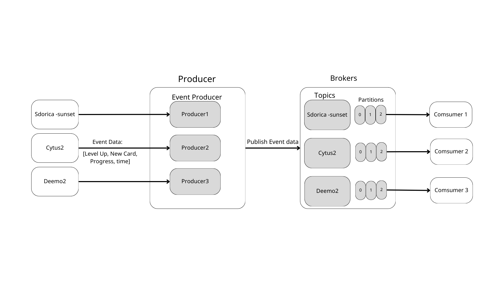

# Kafka Streaming Data Simulator
This project aims to simulate a scenario where clients continuously write data. Each producer (client) sends one piece of data to the Topic every second. The consumer subscribes to the topic to receive data and can persistently store the data.

### Project Structure
```
kafka-project/
|-- src/
|   |-- producers/
|   |   |-- producer_1.py
|   |   |-- producer_2.py
|   |   `-- producer_3.py
|   |-- consumers/
|   |   |-- consumer_1.py
|   |   |-- consumer_2.py
|   |   `-- consumer_3.py
|   |-- topics/
|   |   `-- kafka_topics.py
|   `-- config/
|       |-- kafka_config.py
|       `-- __init__.py
|-- kafka/
|   |-- kafka-data/...
|   `-- docker-compose.yml
|-- requirements.txt
`-- README.md
```
### MySQL
- Create `.env` file in root path
   ```
   MYSQL_USER = USER
   MYSQL_PASSWORD = PASSWORD
   MYSQL_DATABASE = DB
   MYSQL_ROOT_PASSWORD = ROOT PASSWORD
   ```


### Getting Start
1. Create kafka broker `kafka/docker-compose.yml`
   ```
   docker compose up -d
   ```
2. Install python dependency
   ```
   pip install -r requirements.txt
   ```
3. Create Topics `src/topics/kafka_topics.py`
   ```
   python3 kafka_topics.py
   ```
4. Create MySQL Tables
   ```
   python3 exec_sql.py
   ```
5. Run producers `src/producers/.`
   ```
   python3 producer_1.py
   ```
6. Run Consumers `src/consumers/.`
   ```
   python3 consumer_1.py
   ```
