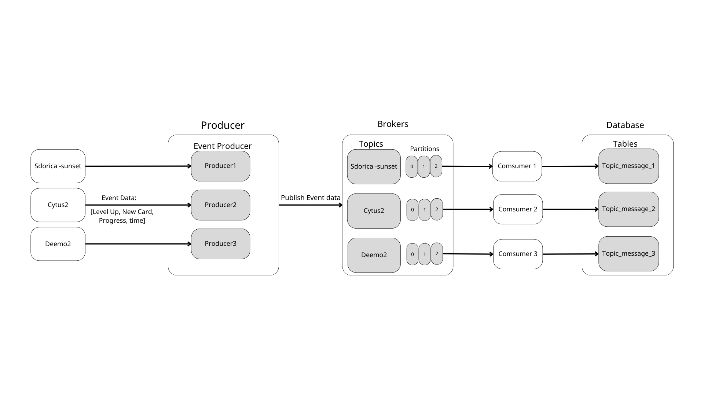

# Kafka Streaming Data Simulator
This project aims to simulate a scenario where clients continuously write data. Each producer (client) sends one piece of data to the Topic every second. The consumer subscribes to the topic to receive data and can persistently store the data.

### Project Structure
```
kafka-project/
|-- src/
|   |-- producers/
|   |   |-- producer_1.py
|   |   |-- producer_2.py
|   |   `-- producer_3.py
|   |-- consumers/
|   |   |-- consumer_1.py
|   |   |-- consumer_2.py
|   |   `-- consumer_3.py
|   |-- topics/
|   |   `-- kafka_topics.py
|   `-- config/
|       |-- kafka_config.py
|       `-- __init__.py
|-- kafka/
|   |-- kafka-data/...
|   `-- docker-compose.yml
|-- requirements.txt
`-- README.md
```